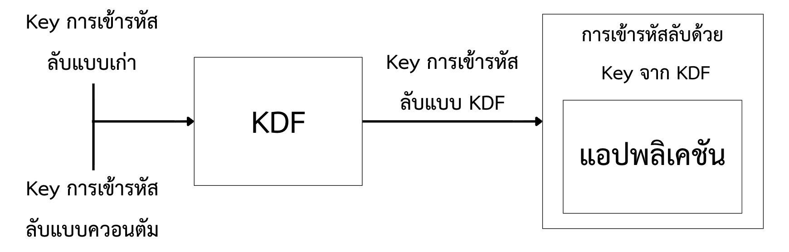
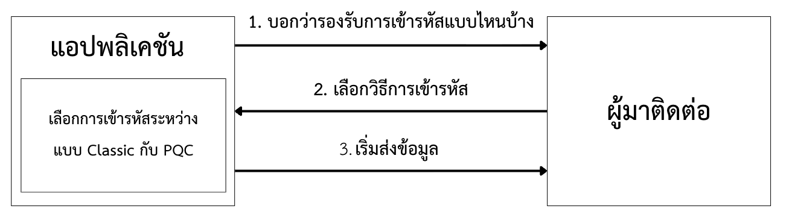

# ทำไหมต้องเปลี่ยนไปใช้ PQC 
[] รอลิงค์ไปอีกบทความ 

# อะไรคือ hybrid post-quantum encryption
คือแนวทางเราจะนำการเข้ารหัสลับแบบ PQC (post-quantum encryption) 
มาใช้โครงสร้างของเราที่มีการสร้างมาแล้ว

## แบบเป็นชั้น ๆ ( Layered )
### คืออะไร
เป็นวิธีที่เราใช้การเข้ารหัสแบบ PQC มาเข้ารหัสข้อมูลก่อนและเอาการเข้ารหัสแบบเก่ามาเข้ารหัสอีกทีเพื่อที่โครงสร้างแอปพลิเคชันเดิมยังคมรับข้อมูลนั้นได้

### ข้อดี
* ติดตั้งง่าย
* โครงสร้างแอปพลิเคชันเดิมยังทำงานได้
### ข้อเสีย
* แอปพลิเคชันมีภาระในการคำนวณมากขึ้น
### Example
บริษัท Apple : Apple’s quantum-safe messaging PQ3 
https://security.apple.com/assets/files/A_Formal_Analysis_of_the_iMessage_PQ3_Messaging_Protocol_Basin_et_al.pdf

## แบบประกอบ (Composite) 
### คืออะไร 
เน้นว่าเป็นการเอา Key หลายแบบมา "ประกอบ" (Compose) กันผ่าน Function จำพวก KDF จนได้ Key ใหม่เพียงอันเดียว
ทำให้ผู้โจมตีต้องแก้รหัสสองครั้งถึงจะได้ Key ที่ใช้ในการเข้ารหัสลับ

### ข้อดี
* ปลอดภัยมาก
### ข้อเสีย
* มีความซับซ้อนในการติดตั้งและออกแบบ
### Exampl
สำนักงานความมั่นคงปลอดภัยด้านสารสนเทของประเทศเยอรมนี
https://www.bsi.bund.de/SharedDocs/Downloads/EN/BSI/Publications/Brochure/quantum-safe-cryptography.pdf

## แบบทำงานร่วมกัน (Interoperable)   
### คืออะไร 
เป็นแนวทางที่ระบบรองรับทั้ง classical cryptography และ NIST PQC (Post-Quantum Cryptography) ทำงานคู่ขนานกัน โดยที่การเลือกใช้ว่าจะเข้ารหัสแบบไหนนั้น ตัดสินใจในตอนที่แอปพลิเคชันทำงานจริง (runtime) ไม่ใช่ตอน deploy
เป้าหมายหลักคือทำให้การเปลี่ยนผ่านไปสู่ post-quantum cryptography ค่อยเป็นค่อยไป ไม่ต้อง migrate ทุกอย่างพร้อมกันทีเดียว (ไม่ต้อง big-bang migration)

### ข้อดี
* ช่วยให้ระบบเก่าและระบบใหม่ทำงานร่วมกันได้ (interoperability) ในระหว่างช่วงเปลี่ยนผ่าน 
* ลดความเสี่ยงจากการ migrate ทั้งระบบในคราวเดียว
### ข้อเสีย
* ไม่สามารถรับประกันได้ว่าการสื่อสารทุก session จะเป็น quantum-safe เพราะยังมีตัวเลือก classical-only อยู่ 
* ต้องทำการ migrate ครั้งที่สองในภายหลัง เพื่อเอา classical option ออกจากระบบให้หมด
### Example
Google's post-quantum support ใน Chrome browser ซึ่ง Chrome รองรับทั้ง classical และ post-quantum key exchange พร้อมกัน แล้วค่อยตัดสินใจตอน handshake ว่าจะใช้แบบไหน ( ยุติการใช้ตั้งแต่วันที่ 13 กันยายน 2567, https://security.googleblog.com/2024/09/a-new-path-for-kyber-on-web.html)

# Table 
( ผมไม่แนใจว่าจะแปล Crypto Aglity ให้เข้าใจง่าย ๆ ยังไงดี )

| วิธีการ Hybrid Encryptio        | แบบเป็นชั้น (Layered)                                    | แบบประกอบ (Composite)                        | แบบทำงานร่วมกัน (Interoperable)                                                       |
|-------------------------------|-------------------------------------------------------|----------------------------------------------|------------------------------------------------------------------------------|
| ข้อดี                           | ไม่ต้องแก้ระบบเดิม                                        | มีความปลอดภัยสูงสุดหากติดตั้งใช้งานอย่างถูกต้อง         | ค่อย ๆ นำไปใช้กับทีล่ะกลุ่มได้                                                       |
| ข้อเสีย                         | มีภาระ (Overhead) เพิ่มเติมในการประมวลผลและข้อมูลั           | การออกแบบกับการติดตั้งมีความซับซ้อนและมีความยืดหยุ่นน้อย | การสื่อสารบางส่วนอาจไม่ปลอดภัยจากควอนตัม และ ต้องมีการย้ายระบบรอบที่สองเพื่อถอดระบบเดิมออก |
| เกิดการเปลี่ยนแปลงที่ไหน (Crypto-agility) | ขั้นตอนการดำเนินการ (At implementation)                  | ขั้นตอนการออกแบบ (At design)                   | ขั้นตอนการใช้งาน (At use)                                                       |
| เหมาะกับการใช้แบบไหน            | แอปพลิเคชันแบบ Standalone ที่เข้าใจขอบเขตการเข้าถึงข้อมูลชัดเจน | แอปพลิเคชั้นที่ต้องการความปลอดภัยสูง                 | แอปพลิเคชั้นที่ต้องทำกับฝ่ายงานอื่นและไม่สามารถควบคุมฝ่ายงานอื่นได้                          |